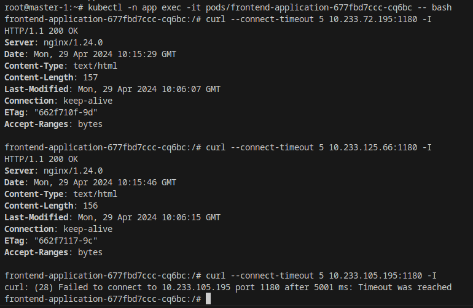
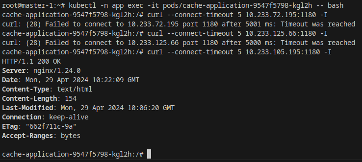

# Автор: Федорчук Дмитрий Сергеевич DEVOPS-33

# Домашнее задание к занятию «Как работает сеть в K8s»

### Задание 1. Создать сетевую политику или несколько политик для обеспечения доступа

1. Создать deployment'ы приложений frontend, backend и cache и соответсвующие сервисы.
2. В качестве образа использовать network-multitool.
3. Разместить поды в namespace App.
4. Создать политики, чтобы обеспечить доступ frontend -> backend -> cache. Другие виды подключений должны быть запрещены.
5. Продемонстрировать, что трафик разрешён и запрещён.

### Выполнение задания 1. Создать сетевую политику или несколько политик для обеспечения доступа

Для выполнения домашнего задания буду использовать виртуальные машины, развернутые в Yandex.Cloud с помощью Terraform:

Ссылка на манифесты Terraform: https://github.com/DemoniumBlack/fedorchukds-devops-33-48/blob/main/SRC/terraform

Сам кластер буду разворачивать используя Kubespray, т.к. там "из коробки" устанавливается сетевой плагин Calico. Кластер состоит из трех Master нод и трех Worker нод:

1. Пишу манифесты deployment'ов приложений frontend, backend и cache и соответсвующие им сервисы.

Ссылка на манифест frontend: https://github.com/DemoniumBlack/fedorchukds-devops-33-48/blob/main/SRC/frontend.yaml

Ссылка на манифест backend: https://github.com/DemoniumBlack/fedorchukds-devops-33-48/blob/main/SRC/backend.yaml

Ссылка на манифест cache: https://github.com/DemoniumBlack/fedorchukds-devops-33-48/blob/main/SRC/cache.yaml

2. В манифестах deployment'ов в качестве образа используется network-multitool.

3. Для размещения подов в namespace app создам этот namespace:

Также в метаданных манифестов deployment'ов и сетевых политик сразу укажу использование namespace app.

4. Пишу манифесты сетевых политик, которые будут разрешать обращаться к приложению пода backend из frontend а также будут разрешать обращаться к приложению пода cache из пода backend. Все остальное будет запрещено. Сначала запрещается весь сетевой трафик, потом разрешается то, что должно быть разрешено.

Ссылка на запрещающий манифест: https://github.com/DemoniumBlack/fedorchukds-devops-33-48/blob/main/SRC/deny-all.yaml

Ссылка на манифест разрешающий обращаться к backend из frontend: https://github.com/DemoniumBlack/fedorchukds-devops-33-48/blob/main/SRC/front-to-back.yaml

Ссылка на манифест разрешающий обращаться к cache из backend: https://github.com/DemoniumBlack/fedorchukds-devops-33-48/blob/main/SRC/back-to-cache.yaml

5. Применю манифесты deployment'ов и сетевых политик:

Проверяю результат:

Создались deployment'ы, поды и сетевые политики в соответствии с заданием.

Проверю, что трафик из frontend в backend и из backend в cache разрешен, остальное запрещено.

В соответствии с моими deployment'ами приложения в подах слушают порт 1180, соответственно к нему я и буду подключаться.

Захожу на под с приложением frontend и проверю, можно ли из него обратиться к приложению backend:

Видно, что frontend имеет доступ к самому себе и имеет доступ к приложению backend, но не имеет доступ к приложению cache.

Захожу на под с приложением backend и проверю, можно ли из него обратиться к приложению cache:

Видно, что backend имеет доступ к самому себе и имеет доступ к приложению cache, но не имеет доступ к приложению frontend.

Захожу на под с приложением cache и проверю, можно ли из него обратиться к приложениям frontend и backend:

Видно, что cache имеет доступ к самому себе, но не имеет доступ к приложениям frontend и backend.

В итоге условия домашнего задания выполнены.